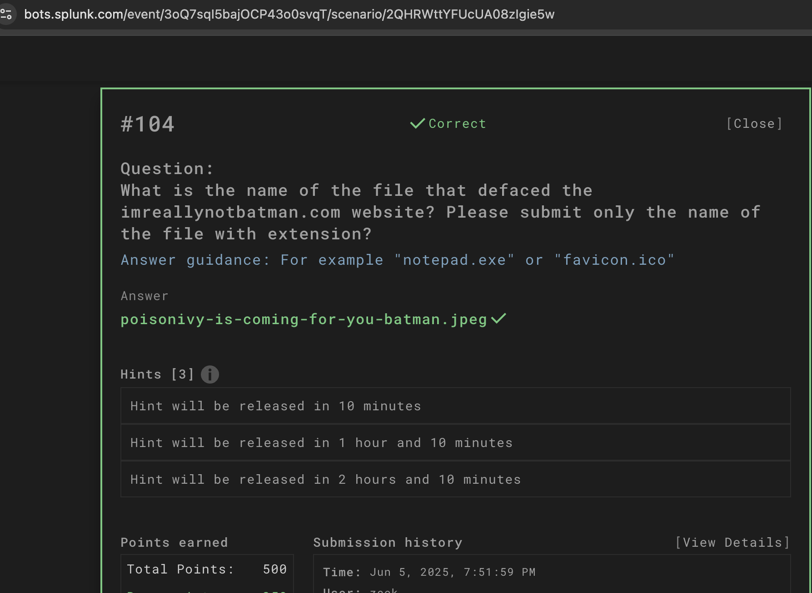

# Defacement Challenge — imreallynotbatman.com

## Challenge Overview  
The goal was to identify the file that defaced the website `imreallynotbatman.com`. This was achieved through log analysis using Splunk.

---

## Tools and Techniques Used

- **Splunk:** For searching and analyzing web server logs to identify unusual file accesses or modifications.
- **Log queries** to pinpoint suspicious activity or file uploads.
- **Cross-referencing timestamps and file names** to confirm the defacement file.

---

## Step-by-Step Process

1. Accessed Splunk dashboard connected to the web server logs.

2. Ran search queries to filter for unusual HTTP requests or file uploads around the suspected time of defacement, for example:

3. Identified the file name `poisonivy-is-coming-for-you-batman.jpeg` in the logs, indicating it was accessed or uploaded during the defacement event.

4. Verified the file presence on the server or web directory.

5. Confirmed this was the defacement file based on the log evidence and file name.

---

## Lessons Learned

- Log analysis is critical in identifying security incidents such as web defacements.  
- Splunk’s powerful query language allows for efficient filtering of large log datasets.  
- Correlating log data with file system checks provides strong evidence for incident verification.

---

## Next Steps

- Develop automated Splunk alerts to detect unusual file uploads or modifications in real-time.  
- Investigate other web server logs for potential related activity.  
- Study web application security measures to prevent unauthorized file uploads and defacements.

